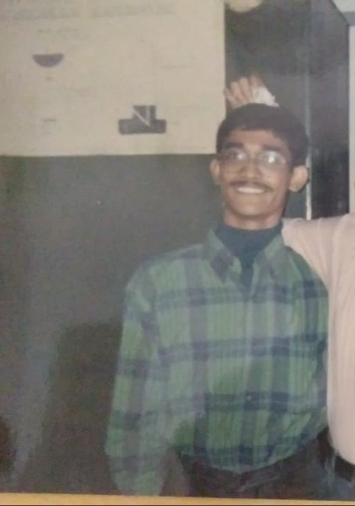
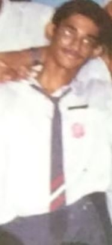
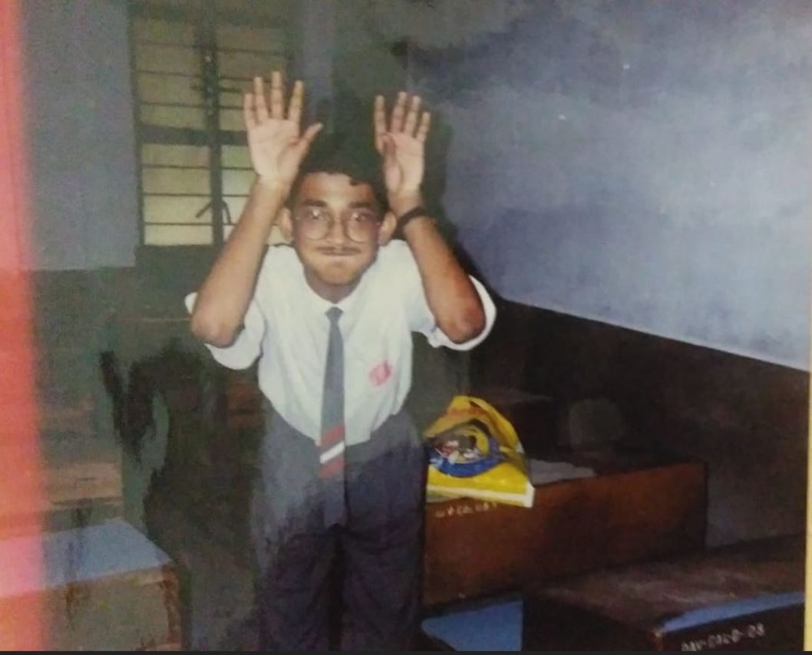

## Introduction

This is a website where we remember our friend Tathagata Sengupta who studied with us in DAV Public School, Kolkata, India.

He was studying Economics at St. Xavier's College, Kolkata, India.

Some thoughts, words and remembrances are below.

We have not forgotten you. You still inspire us and we think about you fondly.

Sourav

Although you are not around us anymore, but we all know that you are watching us from high above & having a broad smug smile on your face. You know that your school friends still love, adore, admire & cherish your precious friendship to this day.  We all keep you in our thoughts & more so in a cosy quiet corner of our hearts. Always Rest in Peace !

Soumya

Words for Tathagata: we have not forgotten you. You still inspire us and we think about you fondly.

Gone but not forgotten.

Tathagata means one who has thus not gone

We remember him as a warm and kind individual. He was good in studies as well as sports.

He used to be good in karate. I remember him in a white karate uniform in school. He was also a very good runner. He was excellent in arm-wrestling.

He was especially fond of Satyajit Ray novels like Feluda and Professor Shonku. I remember he had loaned me a copy of the last Professor Shonku novel written by Satyajit Ray.

He was also fond of science-fiction. He had loaned me a science fiction novel (the story was Dreksel Island er Ghatana and the book was called Selam Professor Shonku). He also read the Encyclopaedia Brittanica; since he was the class monitor, he was allowed access to these in the school library.

He was also very proud of the house (Topaz House) that he used to represent at DAV Public School and enthusiastically participated in all house activities. He was an excellent scholar and athlete.

In school, he frequently used to be the class monitor. He was also school Captain. This honor was usually reserved for the best and brightest.

At the library he used to read lots of books. He was very fond of the Famous Five, the Hardy Boys and Tintin comics.

He was universally adored by all the teachers in our school. He had pride of place in the heart of our favourite teacher, Ms. Achala Satsangi. She was very fond of Tathagata (or Tatha as we used to call him).

I last saw him at the Kolkata Book Fair in 1999. We met by chance and had a brief chat. He wished me happy new year.

The last time we met was when he was travelling on a bus in Kolkata near Behala Thana. He said he wanted to meet. Sadly, that was not to be.

If we remember, they will live.

Pictures of Tathagata taken by our beloved teacher Ms. Achala Satsangi

# Contact

If you want add a message or a picture, please contact Soumya Banerjee neel dot soumya at gmail dot com

